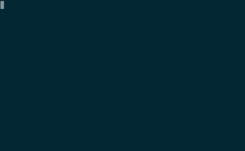

# appreciate [](https://travis-ci.org/musically-ut/appreciate)
> Appreciate the free stuff.


```
npm install -g appreciate
```



## What and Why

Node's eco-system is exploding and there is a lot of open source code out there which gets used over and over again. However, it is easy to forget to say _thank-you_ when you `npm install --save` one of the projects to try it in your own project.

One of the simplest ways of saying _thank-you_ is by starring the project's repository on Github, if it has one. This utility will make it easier for you to keep track of what you have and have not starred.

Run this program in the directory of your node project to see which packages you are using and whether you have _thanked_ them by starring them on Github.

## Where & How

Just install the library globally:

> npm install -g appreciate

Next, you will need to [generate an access token from your Github account](https://help.github.com/articles/creating-an-access-token-for-command-line-use/) without any special scopes and put the token string in the file `~/.appreciate`, as shown in the example above.

## Bugs

Please report them on Github issues page at [musically-ut/appreciate](https://github.com/musically-ut/appreciate).

----

:smile:
